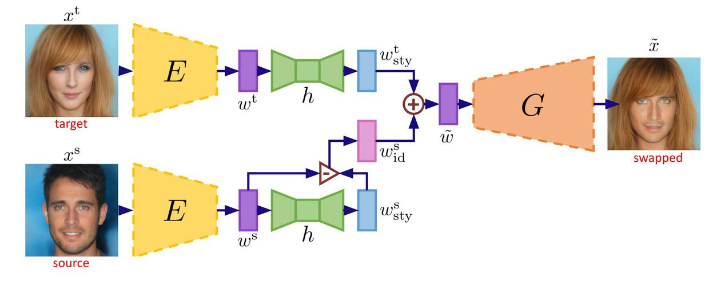
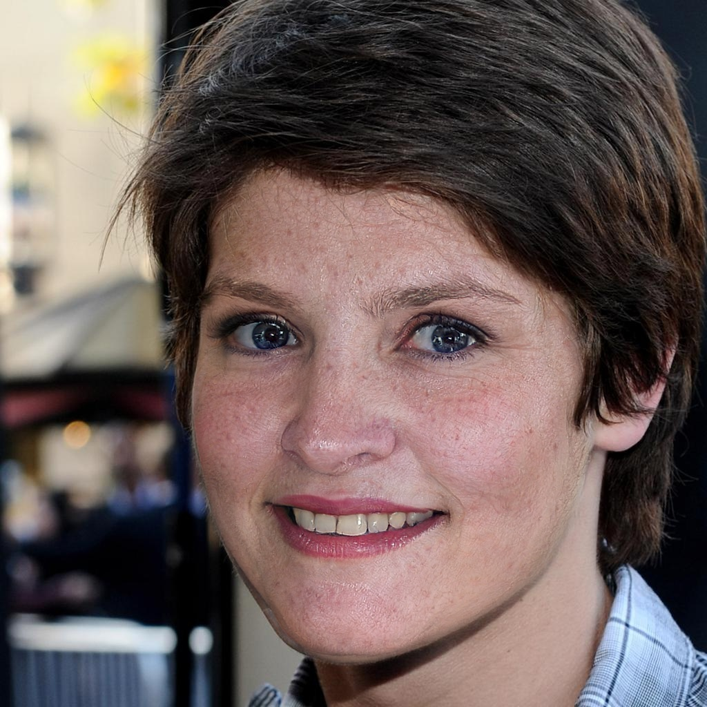

# Face Swapping as A Simple Arithmetic Operation
This repository contains inference script for [Face Swapping as A Simple Arithmetic Operation](https://arxiv.org/abs/2211.10812).



## Preparation
### Requirements

* Python
* PyTorch
* Opencv
* ninja `pip install ninja`

### Pretrained Models

Download the following checkpoint to folder `weights`.

* [StyleGAN2 model](https://drive.google.com/file/d/1EM87UquaoQmk17Q8d5kYIAHqu0dkYqdT/view)
* [e4e FFHQ inversion](https://drive.google.com/file/d/1cUv_reLE6k3604or78EranS7XzuVMWeO/view)
* [Face parser model](https://github.com/truongvu2000nd/AFS/releases/download/v1.0/face_parsing.pth)
* [Style extraction network](https://github.com/truongvu2000nd/AFS/releases/download/v1.0/style_extraction.pth)

## Inference
To swap two images, run
```
python inference.py \
    --src_img demo/source.jpg \
    --tgt_img demo/target.jpg \
    --save_dir demo/output.jpg
```

The swapped image will be saved as `demo/output.jpg`

Source image             |  Target image                |  Output
:-------------------------:|:-------------------------: |:-------------------------:
  |    |  